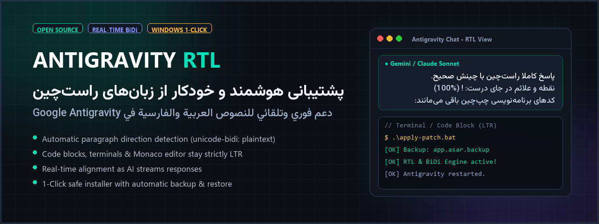
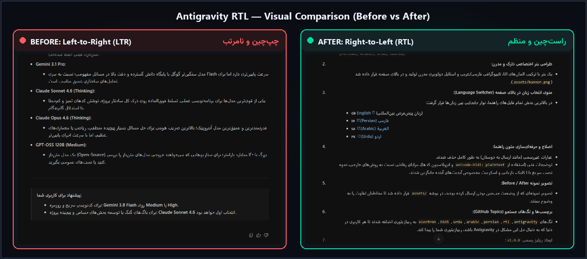

<div align="center">



# Antigravity RTL & BiDi Support

**Seamless automatic Right-to-Left (RTL) & Bidirectional text formatting for Google Antigravity**

[](https://github.com/MOhammaDpirouznia/antigravity-rtl/releases)
[](LICENSE)
[](https://github.com/MOhammaDpirouznia/antigravity-rtl)
[](https://github.com/MOhammaDpirouznia/antigravity-rtl/stargazers)

---

### 🌐 Select Language / تغییر زبان / اختر لغتك / زبان تبدیل کریں
[**English**](README.md) • [**فارسی (Persian)**](docs/README.fa.md) • [**العربية (Arabic)**](docs/README.ar.md) • [**اردو (Urdu)**](docs/README.ur.md)

---

</div>

## 📌 Overview

By default, **Google Antigravity** renders all conversational output, prompts, and markdown lists using standard Left-to-Right (`LTR`) orientation. When reading or writing in Right-to-Left languages such as **Persian (فارسی)**, **Arabic (العربية)**, **Urdu (اردو)**, or **Hebrew (עברית)**:
* Punctuation marks (periods, colons, parentheses) appear misplaced at the wrong side of the line.
* List bullet points and numbered lists remain awkwardly anchored to the left.
* Sentences mixing English keywords (like model names or code identifiers) become jumbled.

**Antigravity RTL** solves this fundamentally by injecting a smart CSS & Preload patch directly into the application runtime, enabling Chromium's native `unicode-bidi: plaintext` engine for real-time, auto-detected RTL and LTR text formatting.

---

## 📸 Visual Comparison (Before vs After)

<div align="center">
  
</div>

| ❌ Before Patch (Default LTR) | ✅ After Patch (Antigravity RTL) |
| :--- | :--- |
| • Persian/Arabic text forced to the left | • Automatic Right-to-Left (RTL) alignment |
| • Bullet points awkwardly anchored to left | • Bullet points & numbers naturally positioned on the right |
| • Misplaced punctuation (periods, colons, brackets) | • Proper punctuation placement at the natural end of lines |
| • Disrupted mixed English & Persian sentences | • Flawless inline English & code keywords |

---

## ✨ Features

* **⚡ 100% Real-Time & Automatic:** Directionality is computed on the fly as the model streams words. Paragraphs starting with RTL characters align to the right, while English paragraphs stay left.
* **🎨 Embedded Offline Fonts & Modular Typography (v1.2.1):** Includes embedded offline fonts or keep original typography — **zero Windows font installation required**:
  * **Option 0:** **Stock Antigravity Font** (Skip / Keep original font unchanged — RTL alignment only)
  * **Option 1:** **Vazirmatn** (Persian/Arabic Modern UI — Clean & Balanced) `[Default]`
  * **Option 2:** **Cairo** (#1 Modern Arabic & Persian UI Font — Google Fonts)
  * **Option 3:** **Sahel** (Soft, Elegant & High Readability)
  * **Option 4:** **Shabnam** (Crisp Geometric Reading Font)
  * **Option 5:** **Windows System Default** (Segoe UI / Tahoma / Arial)
  * **Option 6:** **Custom Font** (Specify any local font installed in Windows)
* **💻 Strict Code Block Isolation:** Inline code (`code`), multi-line code blocks (`pre`), Monaco editor, and terminal outputs are strictly preserved in Left-to-Right (`LTR`) with standard monospace typography.
* **✍️ User Input Alignment:** As you type prompts in the input box, text direction automatically adjusts according to the language you are writing.
* **🚀 Decoupled Process Architecture:** Antigravity launches independently via Windows Shell Execute. Closing the installer terminal window will **never** close Antigravity.
* **🛠️ DevTools Shortcut Enabled:** Adds `Ctrl + Shift + I` shortcut to easily inspect elements and toggle Developer Tools.
* **🛡️ Zero Risk & Instant Rollback:** An automatic backup (`app.asar.backup`) is created before applying any changes. You can restore original factory settings with a single click.

---

## 🚀 Quick Installation (1-Click)

### Option 1: Using the Ready Package (Recommended)
1. Download the latest release from the [**Releases Page**](https://github.com/MOhammaDpirouznia/antigravity-rtl/releases) (or clone this repository).
2. Extract the downloaded archive.
3. Double-click **`apply-patch.bat`**.
4. Select your preferred font:
   * Press `0` to keep the stock Antigravity font unchanged (RTL alignment only).
   * Press `Enter` (or `1`) for Vazirmatn.
   * Press `2` for Cairo, `3` for Sahel, `4` for Shabnam, `5` for Windows Default, or `6` for Custom.
5. The patcher will safely close Antigravity, create a backup, apply the patch, and relaunch Antigravity independently with full RTL support.

---

## 🔄 Restoration / Uninstall

If you ever wish to revert Antigravity back to its original default state:
1. Double-click **`restore-original.bat`**.
2. The script restores the factory `app.asar.backup` and relaunches the app.

---

## ⚙️ Advanced: Auto-Patcher for Future Updates

If Google Antigravity receives a major application update in the future that overwrites the core bundle, you can dynamically unpack, patch, and repack the new version using PowerShell:

```powershell
# Run with PowerShell
Set-ExecutionPolicy -Scope Process -ExecutionPolicy Bypass
.\scripts\auto-patch-script.ps1
```

*Requirements for dynamic script: Node.js / npx installed on your machine.*

---

## 🔬 How It Works (Technical Overview)

Antigravity 2.0 is built on the **Electron / Chromium** architecture. The application package (`app.asar`) contains a `dist/preload.js` script that executes in every BrowserWindow before DOM rendering.

This patch hooks into `preload.js` and applies:
1. `unicode-bidi: plaintext !important; text-align: start !important;` to message containers, paragraphs, headers, and inputs.
2. Dynamic `dir="auto"` attribute injection across dynamic markdown DOM mutations (using a `MutationObserver`).
3. Explicit `direction: ltr !important; unicode-bidi: isolate !important;` isolation for all `pre`, `code`, tables, and terminal containers.

---

## ❓ Frequently Asked Questions (FAQ)

### Why is Persian, Arabic, or Urdu text left-aligned in Google Antigravity?
By default, the Electron renderer in Google Antigravity lacks native `dir="auto"` or `unicode-bidi: plaintext` rules on its message markdown containers. As a result, all paragraphs default to the standard Chromium Left-to-Right (`LTR`) orientation.

### How does this patch fix the text direction issue in Antigravity?
The patch injects modern CSS rules into Antigravity's preload script. This enables Chromium's native bidirectional algorithm to inspect the first character of each paragraph: if it's an RTL character (Persian, Arabic, Urdu, Hebrew), the paragraph instantly aligns right with proper punctuation and bullet points; if it's Latin, it remains left-aligned.

### Does this patch interfere with code blocks, terminal outputs, or Monaco editor?
No. All `<pre>`, `<code>`, Monaco editor, and terminal elements are explicitly isolated with `direction: ltr !important; text-align: left !important; unicode-bidi: isolate !important;`. Your code indentation and syntax highlighting remain completely untouched.

---

## 🔍 SEO & Search Keywords

<details>
<summary><b>Click to expand search keywords and indexed topics</b></summary>

`google antigravity rtl` • `antigravity right to left` • `antigravity persian font` • `antigravity farsi` • `antigravity arabic fix` • `antigravity urdu support` • `antigravity hebrew` • `antigravity bidi patch` • `google antigravity text direction` • `antigravity electron asar patch` • `fix rtl in antigravity ide` • `antigravity ide persian support` • `antigravity chat right to left` • `antigravity markdown rtl` • `vazirmatn font antigravity` • `راست چین کردن آنتی گرویتی` • `حل مشکل چپ چین بودن در آنتی گرویتی` • `فارسی نویسی در گوگل آنتی گرویتی` • `پچ راست چین آنتی گرویتی` • `فونت فارسی در Antigravity` • `حل مشکل به هم ریختگی فونت فارسی در antigravity` • `محاذاة النص العربي في google antigravity` • `حل مشكلة اتجاه النص في antigravity` • `تعريب جوجل آنتی جرافيتي` • `اینٹی گریویٹی اردو سپورٹ`

</details>

---

## 🤝 Contributing

Contributions, issues, and feature requests are welcome! Feel free to check the [issues page](https://github.com/MOhammaDpirouznia/antigravity-rtl/issues).

---

## 📄 License

This project is licensed under the [MIT License](LICENSE).

