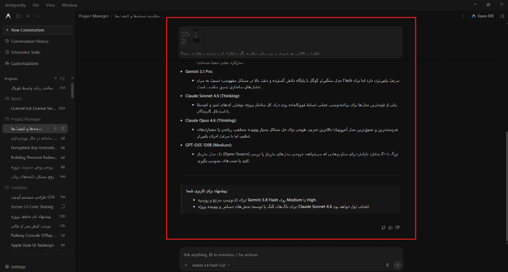

<div align="center">


# پچ جامع راست‌چین و فونت فارسی Google Antigravity

**پشتیبانی هوشمند و خودکار از زبان‌های راست‌چین (RTL) و علائم نگارشی برای آنتی‌گرویتی**

[](https://github.com/MOhammaDpirouznia/antigravity-rtl/releases)
[](../LICENSE)
[](https://github.com/MOhammaDpirouznia/antigravity-rtl)

---

### 🌐 تغییر زبان / Select Language / اختر لغتك
[**English**](../README.md) • [**فارسی (Persian)**](README.fa.md) • [**العربية (Arabic)**](README.ar.md) • [**اردو (Urdu)**](README.ur.md)

---

</div>

## 📌 معرفی پروژه

به صورت پیش‌فرض، نرم‌افزار **Google Antigravity** تمام پیام‌ها، متون گفتگو و لیست‌های مارک‌داون را در جهت چپ‌به‌راست (`LTR`) نمایش می‌دهد. این موضوع هنگام استفاده از زبان‌های راست‌چین مانند **فارسی**، **عربی** یا **اردو** مشکلات آزاردهنده‌ای ایجاد می‌کند:
* علائم نگارشی مثل نقطه، دو‌نقطه، پرانتزها و علامت سؤال در ابتدای خط یا جای اشتباه ظاهر می‌شوند.
* بالت‌ها و شماره‌های لیست به سمت چپ می‌چسبند در حالی که متن در راست است.
* ترکیب کلمات انگلیسی و فارسی جملات را نامنظم و ناخوانا می‌کند.

پروژه **Antigravity RTL** با تزریق یک اسکریپت سبک به هسته اجرایی برنامه (Preload)، قابلیت تشخیص خودکار و بومی کرومیوم (`unicode-bidi: plaintext`) را فعال کرده و تجربه کاربری کاملی برای متون فارسی فراهم می‌کند.

---

## 📸 تصاویر نمونه

### قبل از پچ (متن چپ‌چین و به‌هم‌ریخته):


> **توجه:** در تصویر بالا متن فارسی چپ‌چین بوده، بالت‌ها در سمت چپ قرار دارند و علائم نگارشی جابه‌جا شده‌اند.

---

## ✨ ویژگی‌های کلیدی

* **⚡ ۱۰۰٪ خودکار و زنده (Real-Time):** نیازی به هیچ کلید میانبر یا کپی‌پیست نیست. حین تایپ پاسخ توسط هوش مصنوعی، پاراگراف‌های فارسی خودکار راست‌چین و متون لاتین چپ‌چین می‌شوند.
* **💻 تفکیک کامل کدهای برنامه‌نویسی:** بلاک‌های کد (`pre/code`)، ادیتور موناکو و خروجی ترمینال کاملاً دست‌نخورده، چپ‌چین و با فونت مونو‌اسپیس باقی می‌مانند.
* **✍️ راست‌چین شدن کادر پیام شما:** هنگام تایپ پرامپت در کادر چت، جهت متن بر اساس زبان نوشتار به صورت آنی تنظیم می‌شود.
* **🔤 فونت و تایپوگرافی چشم‌نواز:** تعریف فونت‌های بهینه‌سازی‌شده فارسی (`Vazirmatn`, `Segoe UI`, `Tahoma`) برای خوانایی بهتر.
* **🛠️ فعال‌سازی منوی DevTools:** کلید میانبر `Ctrl + Shift + I` برای باز کردن ابزارهای توسعه‌دهنده در برنامه فعال می‌شود.
* **🛡️ امنیت کامل با بکاپ خودکار:** قبل از هر تغییری، یک نسخه پشتیبان امن (`app.asar.backup`) ایجاد می‌شود و با یک کلیک امکان بازگشت به تنظیمات کارخانه وجود دارد.

---

## 🚀 راهنمای نصب سریع (روش ۱ کلیک)

1. آخرین نسخه را از [**صفحه Releases**](https://github.com/MOhammaDpirouznia/antigravity-rtl/releases) دانلود کرده یا مخزن را کلون کنید.
2. فایل فشرده را استخراج (Extract) کنید.
3. روی فایل **`apply-patch.bat`** دابل کلیک کنید.
4. اسکریپت برنامه را بسته، بکاپ گرفته، فایل را جایگزین کرده و Antigravity را مجدداً با پشتیبانی راست‌چین اجرا می‌کند.

---

## 🔄 بازگردانی به حالت اولیه (Uninstall)

اگر به هر دلیلی خواستید برنامه را به حالت اولیه بازگردانید:
* کافیست روی فایل **`restore-original.bat`** دابل کلیک کنید تا فایل اصلی بکاپ جایگزین شود.

---

## ⚙️ اسکریپت مخصوص آپدیت‌های آینده

اگر در آینده Antigravity یک به‌روزرسانی بزرگ دریافت کرد، می‌توانید با اجرای اسکریپت پاورشل، نسخه جدید را به صورت پویا استخراج و پچ کنید:

```powershell
Set-ExecutionPolicy -Scope Process -ExecutionPolicy Bypass
.\scripts\auto-patch-script.ps1
```

---

## 📄 لایسنس

این پروژه تحت لایسنس [MIT](../LICENSE) منتشر شده است و استفاده از آن کاملاً آزاد و رایگان می‌باشد.
